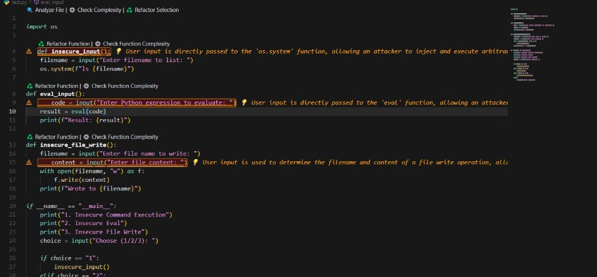
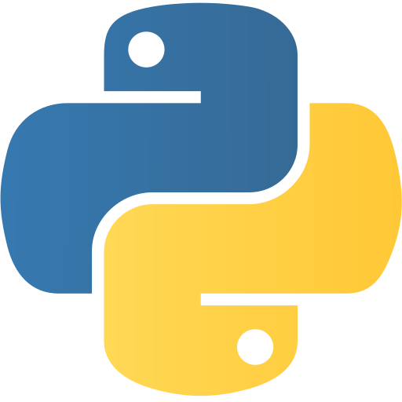
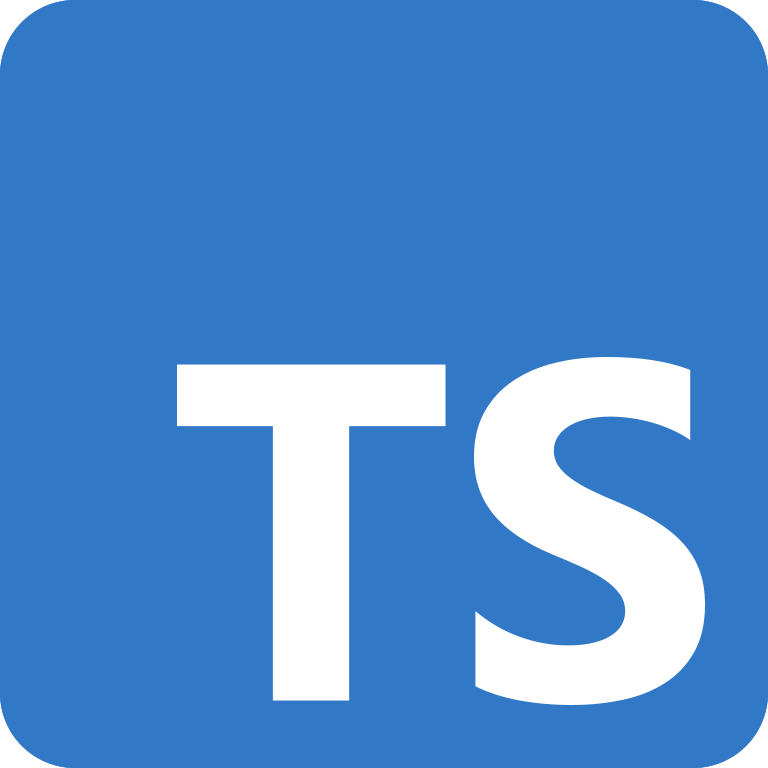
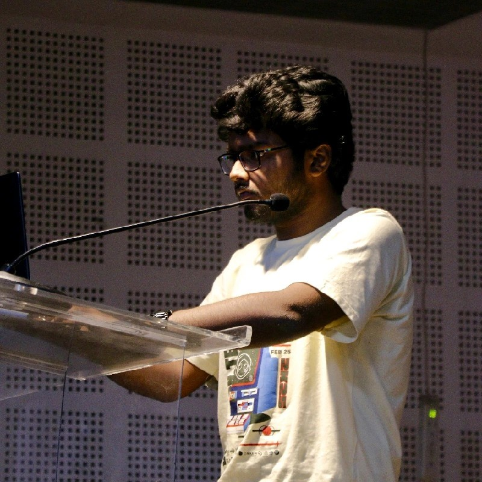
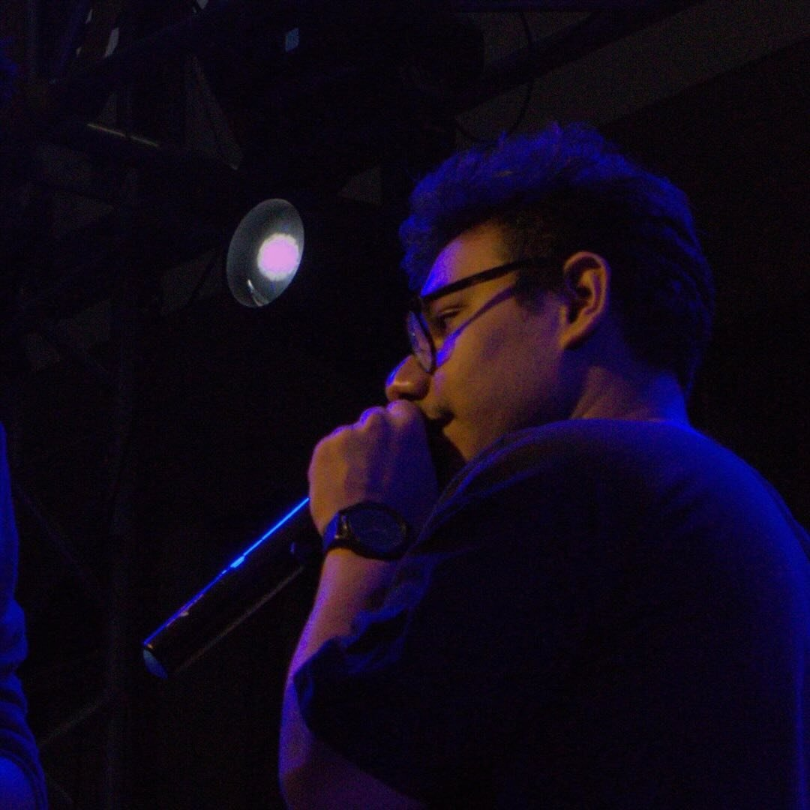
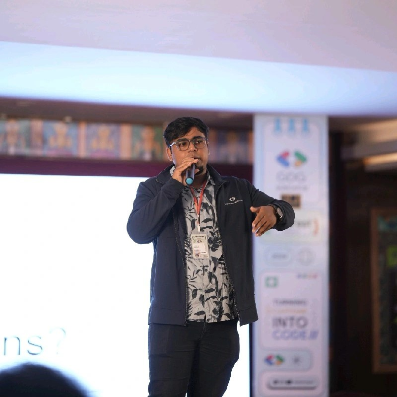
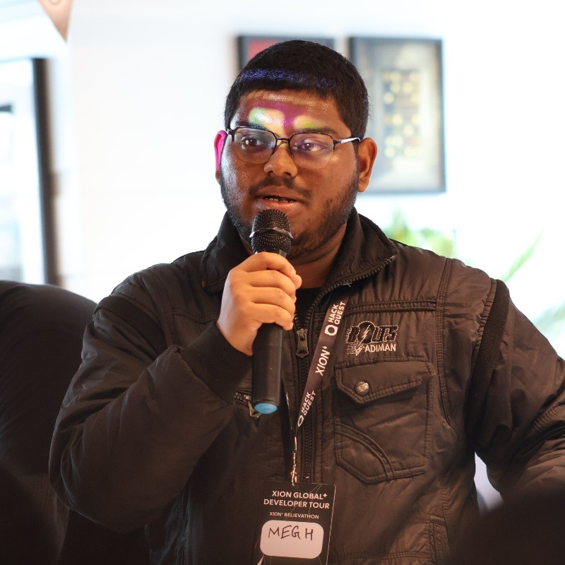

# 🪿 Goosy - Make Your Code Production Ready

**Code Smarter. Debug Cleaner. Refactor Faster.**

Meet Goosy, the sassy AI that turns your messy code into production-ready masterpieces! No more crying over spaghetti code - Goosy's got your back (and your bugs' funeral plans ready).

> 🚀 **Warning: May cause sudden bursts of confidence and an irresistible urge to show off your clean code!**

---

## 📸 See Goosy in Action

*Goosy transforming messy code into production-ready masterpieces!* ✨

---

## ✨ Why Goosy Will Make You The Office Hero

<table>
<tr>
<td width="33%">

### 🐛 **Bug Detective Mode**
Goosy sniffs out vulnerabilities like a bloodhound with a computer science degree. Your security flaws don't stand a chance against our AI Sherlock Holmes!

*"Elementary, my dear Watson... your SQL injection is showing."* 🔍

</td>
<td width="33%">

### 🧮 **Complexity Killer**
Select any code block and watch Goosy judge it harder than Gordon Ramsay judges a burnt soufflé. Get instant feedback on whether your code is "beautiful" or "an absolute disaster."

*"This function is more complex than my relationship status!"* 📊

</td>
<td width="33%">

### 🧙‍♂️ **Refactoring Wizard**
One click and POOF! Your messy code transforms into something so clean, Marie Kondo would weep tears of joy. Original code preserved as comments (because we're not monsters).

*"Abracadabra! Your code no longer looks like it was written by caffeinated squirrels!"* 🎩

</td>
</tr>
</table>

---

## 🚀 How to Become a Code Wizard (In 5 Easy Steps!)

### 🎯 Installation (AKA "Summoning Goosy")
1. Open VS Code (if it's not already glued to your screen)
2. Hit `Ctrl+Shift+X` like you're casting a spell ✨
3. Type "Goosy" (not "Goosey" - we're not a waterfowl!)
4. Smash that Install button harder than you hit snooze on Monday morning

### 🎮 Usage (AKA "Unleashing the Magic")
1. **Open** any Python, JavaScript, or TypeScript file (we speak fluent nerd)
2. **Select** the code that's been giving you nightmares 😱
3. **Press** `Ctrl+Shift+P` and feel the power coursing through your fingertips
4. **Search** for "Goosy" and pick your poison:
   - 🔍 **Analyze Selection** - "CSI: Code Scene Investigation"
   - 🧩 **Check Complexity** - "Is my code a hot mess? Let's find out!"
   - ✨ **Refactor Selection** - "Make it pretty, make it fast, make it NOW!"
5. **Watch** as Goosy works its magic faster than you can say "Stack Overflow"

*Pro Tip: Keep tissues handy - you might cry tears of joy!* 😭✨

---

## 💻 Languages We Speak (Fluently, We Promise!)

|  **Python** |  **JavaScript** |  **TypeScript** |
|:---:|:---:|:---:|
| 🐍 Ssssseriously Good | 🟨 Vanilla & Spicy | 🔷 Typed to Perfection |
| ✅ **VIP Treatment** | ✅ **VIP Treatment** | ✅ **VIP Treatment** |
| Bug Hunting Complexity Shaming Code Beautification | Bug Hunting Complexity Shaming Code Beautification | Bug Hunting Complexity Shaming Code Beautification |

*Coming Soon: We're learning C++ (send help and energy drinks!)* ☕

---

## 🎬 See Goosy in Action (Better Than Netflix!)

**Ready to have your mind blown?** 🤯

*Warning: May cause uncontrollable excitement and sudden urges to refactor everything in sight!*

---

## 💻 Meet the Developers Team

*"They came, they coded, they conquered... and somehow survived on nothing but caffeine and pure determination."*

|  |  |  |  |
|:---:|:---:|:---:|:---:|
| **Akash** | **Abhinaba** | **Ayush** | **Rohit** |
| AI Overlord | Neural Necromancer | Stack Slayer | Code Dictator |
| *"I speak Robot"* 🤖 | *"I raise the dead... bugs"* 💀 | *"Full Stack? More like Full Snack!"* 🍕 | *"Coffee is my programming language"* ☕ |
|   |   |   |   |

*These legends turned their late-night coding sessions and existential dread into pure magic!* ✨

---

## 📃 License

This masterpiece is licensed under the MIT License - which basically means "use it, love it, but don't blame us if you become too productive and your boss gives you more work!" 😅

Check out the [LICENSE](LICENSE) file for the boring legal stuff.

---

## 🙏 Shoutouts & High Fives

- 👏 **VS Code Team** - For creating the playground where our dreams come true
- 🧪 **Beta Testers** - The brave souls who clicked on our early builds without crying
- ☕ **Coffee** - The real MVP behind every line of code
- 🌙 **Insomnia** - Our faithful companion through countless 3 AM debugging sessions
- Built with ❤️, 😭, and way too much ☕ by the **null0x team**

---

## 🌟 Our Awesome Mentors & Guiding Stars

*"Behind every great code, there are amazing mentors who believed in the impossible and guided us through the chaos!"*

|  |  |  |  |  |
|:---:|:---:|:---:|:---:|:---:|
| **Narendra Nath Chatterjee** | **Soham Banerjee** | **Imran Roshan** | **Sanglap Mridha** | **Megh Deb** |
|  |  |  |  |  |

*These incredible humans shared their wisdom, patience, and probably a few existential crises with us!* 🙏✨

---

**🌟 IF GOOSY MADE YOUR DAY BETTER, SPREAD THE LOVE! 🌟**

*Leave us a review and make our caffeine-addicted hearts happy!* ☕💖

**P.S.** - *If Goosy doesn't make your code at least 69% more awesome, you probably need more coffee!* ☕😉

